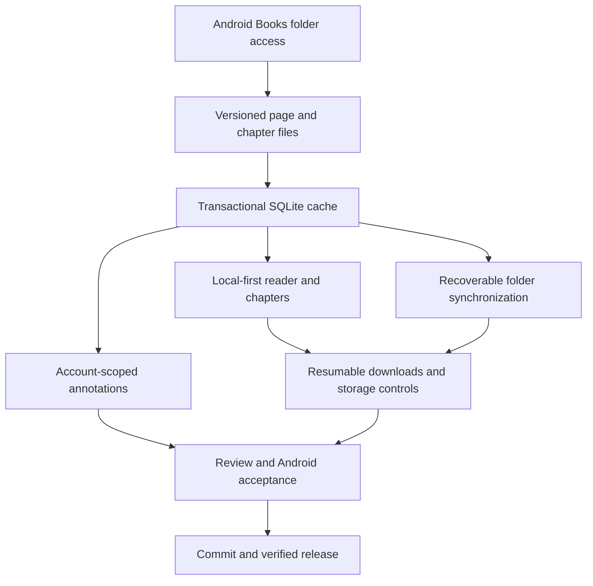

# Plan: Mobile Book Local Cache

## Type
Feature

## Status
In Progress

## Created Date
2026-09-08

## Last Updated
2026-09-09

## Goal Or Problem
Persist book pages and complete chapter trees for immediate offline reading, with portable files under the user's preferred Android/media/com.alghurobaa.podcast/Books/book-{databaseBookId}/ directory. Preserve formatting, annotations, metadata, and the existing automatic foreground WebView acquisition flow.

## Current Context
The app already opens al_ghurobaa.db with Expo SQLite/Drizzle. Legacy downloads write normalized book tables, while the former offline hook was a stub. The automatic WebView reader was committed separately as 8084f8ce. Cache implementation is committed and pushed on main as b5f678f3. Existing .brain/ is retained; no .brain migration is part of this feature.

## Current Release State
- API deployment for b5f678f3 succeeded; a read-only production download-manifest check returned HTTP 200. The additive production annotation schema was pushed earlier.
- Android preview 2026.09.09 is published: update group f1d2ffdc-edfe-4cf5-a6a1-80f88874afbd, runtime 1.0.111. Generated version bump and release notes belong to the follow-up release commit.
- Tickets 2/3/5/6 are complete. Build-variant/remaining storage edge-case and installed-preview acceptance stay open. No claim of whole-story completion.
- Sentry source-map follow-up failed after OTA publication; retry was safety-rejected pending explicit approval to upload application source maps. Do not republish the OTA to retry source maps.

## Proposed Approach
- Keep the live SQLite database and private reader/user metadata in app-private storage. Never relocate or copy the live DB/WAL files into Android/media.
- Use the preferred Books directory for automatically maintained public book JSON files. Resolve access through Android SAF, validate the selected directory, and verify actual device behavior rather than hardcode /sdcard paths.
- Structure public files as book-{bookId}/manifest.json, chapters.json, pages/page-{pageId}.json, and optional derived Markdown/media. Book and page IDs are application database IDs, not Shamela identifiers.
- Preserve application source mappings separately: e.g. application book 3/page 12 can refer to Shamela book 23833/page 106.
- SQLite is authoritative. Use atomic per-page upserts and validated complete chapter snapshots; queue file publication durably in the same transaction. External file failure must not invalidate the saved reader copy.
- SAF does not provide atomic rename through the current Expo adapter. Use verified pending writes and validated previous copies, not an unsupported atomic-publication claim.
- Render local content before background requests. Resolve local page, then server page, then the existing concealed WebView acquisition flow. Never attempt a missing source page while offline.
- Persist cursor-based download progress; advance only after each page is committed. Complete only against a verified unchanged server snapshot. Downloaded server-available pages are not necessarily the whole Shamela book.
- Preserve unsynced annotations/drafts and protect their content during eviction. Enforce account boundaries. Do not export private comments, highlights, account identifiers, or drafts by default.
- User decision: use private per-device annotation sync rather than introduce a full login system. Existing login/profile scaffolding is not a verified server identity. Guest annotations stay local until a capability-owned, retry-safe sync path is implemented; never use shared user 1 as the privacy boundary.
- Restore folder content only through strict schema/identity validation and explicit user action; never upload restored edits automatically.
- Retain no style + className combinations on newly edited React Native components. Use existing UI patterns, not native Modal/Alert for compact confirmation overlays.

### Preferred Folder Contract
```text
Android/media/com.alghurobaa.podcast/Books/
  book-{databaseBookId}/
    manifest.json
    chapters.json
    pages/
      page-{databasePageId}.json
    media/                       # Optional downloaded assets
```

- Example: book-3/pages/page-12.json can represent Shamela book 23833, source page 106. Source page numbers must never substitute for application database IDs in filenames.
- JSON preserves the formatted document and footnotes. Optional page-12.md is a derived export, never the authoritative reader or annotation store.
- The preferred location is a user-selected external content mirror, not the live SQLite location. Request folder access and display the actual selected location; do not promise silent access to a hardcoded filesystem path.
- If the preferred folder cannot be selected, retain fully functional private SQLite caching. Explain the limitation and offer selection of another Books folder; never silently switch the external destination.
- Revoked folder permission pauses exports, not reading or page saves. A folder change must enqueue existing eligible cached content for the new destination even when its old mirror jobs were already acknowledged.
- Keep one declared preferred destination across build variants. Verify each installed variant's grant separately rather than assuming a production package path is automatically writable by a preview build.

## Visual Plan


## Implementation Steps
1. [Ticket 1/8: Android Book Folder Access](../tasks/2026-09-08-android-book-folder.md)
2. [Ticket 2/8: Versioned Book Content Format](../tasks/2026-09-08-book-cache-format.md)
3. [Ticket 3/8: Transactional SQLite Book Cache](../tasks/2026-09-08-book-cache-sqlite.md)
4. [Ticket 4/8: Recoverable Book Folder Synchronization](../tasks/2026-09-08-book-cache-folder-sync.md)
5. [Ticket 5/8: Local-First Book Screens](../tasks/2026-09-08-book-cache-reader.md)
6. [Ticket 6/8: Annotation Protection And Account Isolation](../tasks/2026-09-08-book-cache-annotations.md)
7. [Ticket 7/8: Resumable Downloads And Storage Controls](../tasks/2026-09-08-book-cache-downloads.md)
8. [Ticket 8/8: Book Cache Review And Android Acceptance](../tasks/2026-09-08-book-cache-acceptance.md)

## Affected Files Or Areas
- apps/expo-app/src/db/local-db.ts and book-cache-db.ts
- apps/expo-app/src/lib/book-cache-*.ts
- apps/expo-app/src/hooks/use-cached-book-chapters.ts and use-cached-reader-page.ts
- Reader, chapter, book library, detail, storage, and settings screens
- BookPageLoaderProvider and chapter import completion notifications
- Existing annotation, draft, bookmark, and offline-download modules
- apps/api/src/trpc/routers/book.routes.ts and book-chapter.routes.ts

## Acceptance Criteria
- The selected Books folder contains application-ID-named, validated content files.
- Cached page 106 and a complete tree open after airplane mode plus force-stop/reopen.
- Local chapter search, cached chapter taps, and cached swipes do not require server requests.
- Missing offline pages show a reconnect action; online missing pages use the existing WebView flow and return to the intended reader.
- Formatted content, footnotes, colored highlights, comments, bookmarks, and drafts survive caching and reimport.
- Interrupted writes/downloads resume without duplicate pages, corrupted published trees, or lost prior content.
- File synchronization and restoration respect identity, size, account, and privacy boundaries.
- Cache cleanup never deletes unsynced user data and reports retained protected pages.
- Full relevant regression checks, code review, device verification, and intended commits are recorded.

## Test Plan
- Pure format/path/hierarchy validation, including 5,000-deep trees.
- Real SQLite tests for atomic rollback, account isolation, stale responses, migrations, metadata, and download checkpoints.
- File adapter tests for truncation, permission errors, previous-copy recovery, and generation-safe retries.
- API tests for consistent lean tree snapshots, bounded page IDs, and download manifests.
- Android development build tests followed by actual preview verification when released. Do not conflate either with Bun tests.

## Risks / Edge Cases
- Android/media access and package variants require real-device/emulator verification; SAF support alone is not proof.
- Uninstall/clear-data behavior is not a backup guarantee. Portable files exclude private annotations.
- Legacy user data has incomplete account attribution; preserve it rather than assign it to an arbitrary account.
- Source content can change during download; keep valid cached pages but do not report complete against a changed snapshot.
- Public content files can be externally modified. Validate and restore locally only.
- New API response metadata/endpoints require server deployment; current source changes alone do not prove production behavior.
- Local SQLite migrations do not require production Prisma db push. Only a later actual server-schema change would require it.

## Open Questions
- TODO: Verify preferred directory access on installed Android build variants.
- Resolved: retain legacy unscoped annotations in the guest-local scope; only the capability-owned per-device protocol can sync eligible new changes. Native profile isolation and real local SQL sync tests are recorded in Ticket 6.
- TODO: Record actual preview deployment/acceptance evidence before marking the feature complete.
- Required release order reconfirmed by user: finish story, commit all story code, push, run Expo Update preview, and record the update identifier and actual preview acceptance.

## Linked Task
- Primary companion: [Ticket 1/8](../tasks/2026-09-08-android-book-folder.md)
- All eight execution tickets are linked above; their checklists are the source of progress truth.
