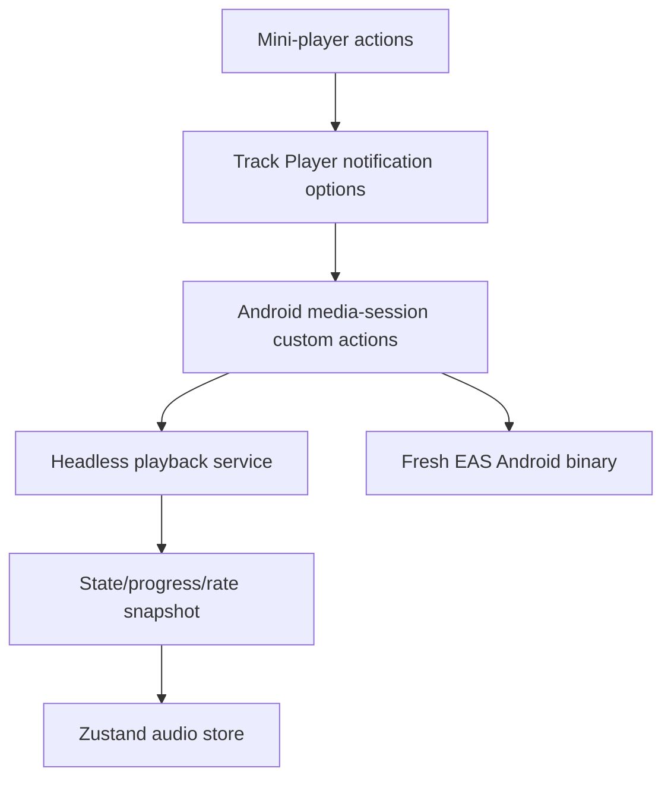

# Plan: Android Media Notification Controls

## Type
Bug Fix

## Status
Implemented; awaiting fresh EAS development/preview device acceptance

## Created Date
2026-06-23

## Last Updated
2026-07-23

## Goal Or Problem
Android system media notification controls are visible for audio playback, but the user reports that the controls do not work. The screenshot shows Android's media output card with Al-Ghurobaa metadata, progress, a center play button, jump buttons, and outer buttons that use custom speed/comment-style icons.

## Implementation Outcome
- The Android notification now mirrors the mini-player with playback speed, back five seconds, system-managed play/pause, forward five seconds, and open comments.
- Speed and comments use stable native custom-action IDs and a `remote-custom-action` event. They no longer overload `SkipToPrevious` or `SkipToNext`.
- Android 13+ receives four `PlaybackState` custom-action providers; older Android receives equivalent MediaStyle buttons while preserving the same JavaScript action IDs.
- Completed remote actions publish playback state, progress, and rate snapshots to the audio store, with an additional foreground resync after the app becomes active.
- Track Player service registration is Android-only, fail-visible, and idempotent before Expo Router loads.
- The Android app version is `1.0.109`. A new EAS development/preview build is required before device acceptance.

## Original Context
Android playback uses `react-native-track-player`; iOS still uses `expo-av`.

Relevant files:
- `apps/expo-app/index.js` registers `playbackService` before Expo Router starts.
- `apps/expo-app/src/services/audio-player/setup-track-player.ts` configures player capabilities, notification capabilities, compact notification buttons, jump intervals, and Android foreground playback behavior.
- `apps/expo-app/src/services/audio-player/playback-service.ts` handles remote play, pause, previous, next, jump backward, jump forward, seek, stop, and duck events.
- `apps/expo-app/src/store/audio-store.ts` prepares TrackPlayer, loads a single active track, requests Android 13+ notification permission, starts foreground playback, syncs progress into Zustand, and persists audio state.
- `apps/expo-app/app.config.ts` declares `FOREGROUND_SERVICE`, `FOREGROUND_SERVICE_MEDIA_PLAYBACK`, and `POST_NOTIFICATIONS`.

Original observed code behavior:
- `notificationCapabilities` currently includes `SkipToPrevious`, `JumpBackward`, `Play`, `JumpForward`, and `SkipToNext`, but not `Pause`.
- `compactCapabilities` currently includes `JumpBackward`, `Play`, and `JumpForward`.
- `previousIcon` is set to the speed icon and `nextIcon` is set to the plus icon.
- `Event.RemotePrevious` cycles playback speed instead of navigating to a previous track.
- `Event.RemoteNext` opens comments instead of navigating to a next track.
- The queue usually contains one loaded track because `loadAudio` calls `TrackPlayer.reset()` and `TrackPlayer.add(track)`.

Likely causes:
- The Android notification is being asked to show media-session skip actions for app-specific actions. On a one-track queue, previous/next are semantically weak and may be disabled, ignored, or displayed in a misleading way by Android/Bluetooth/media-session clients.
- The notification exposes `Play` but not `Pause`, so the center control can become state-inconsistent or non-actionable when Android expects the matching transport action for the current player state.
- Remote actions call TrackPlayer directly from the headless service, while app UI state is updated separately through foreground listeners and polling. This can make actions appear dead or stale if the foreground JS store is not active or does not receive a follow-up state snapshot.
- If the currently installed APK/dev client was not rebuilt after adding TrackPlayer service/permission/native config changes, the JS can show the notification metadata while remote buttons still fail because native service registration or manifest state is stale. OTA updates cannot safely fix native service wiring.

## Implemented Approach
- Publish back/forward five seconds as native Android media-session custom actions alongside speed and comments. Leave play/pause state-driven and system-managed.
- Publish speed/comments through stable custom-action IDs instead of previous/next capabilities. Reserve previous/next for real queue navigation.
- Use explicit monochrome icons for back/forward, comments, and each supported playback-rate state.
- Fetch playback state, progress, and rate after every completed remote action and synchronize that snapshot into Zustand.
- Re-register the current notification options after a rate change so the speed-state icon updates.
- Require a fresh native binary because the Track Player patch cannot be delivered by OTA.

## Visual Plan

## Implementation Steps
- [x] Define and test the exact expanded/compact action contract.
- [x] Extend the Track Player patch with Android custom options, native providers, and `RemoteCustomAction`.
- [x] Implement bounded five-second seek, speed cycling, comments navigation, and completed-action snapshots.
- [x] Register the Android playback service exactly once before Expo Router starts.
- [x] Synchronize remote snapshots and foreground resyncs into the audio store.
- [x] Add monochrome icons and bump the app version to `1.0.109`.
- [x] Run focused tests and compile the patched Track Player Android module.
- [ ] Build fresh EAS development and preview binaries and complete device acceptance.

## Affected Files Or Areas
- `apps/expo-app/src/services/audio-player/setup-track-player.ts`
- `apps/expo-app/src/services/audio-player/playback-service.ts`
- `apps/expo-app/src/store/audio-store.ts`
- `apps/expo-app/app.config.ts`
- `apps/expo-app/index.js`
- `brain/features/audio.md`
- Android native build output / installed APK

## Acceptance Criteria
- Android notification play starts playback when paused.
- Android notification pause pauses playback when playing.
- Android notification jump backward moves playback backward by the configured interval.
- Android notification jump forward moves playback forward by the configured interval.
- Notification progress and play/pause state stay in sync after remote actions.
- No speed/comment buttons appear in the Android system media notification unless they are implemented as validated, supported media-session actions.
- A rebuilt Android APK/dev client behaves consistently after app backgrounding, lock screen use, and reopening the app.

## Test Plan
- Install a freshly rebuilt Android app on the target device.
- Play a known audio item and verify the notification appears with title, artist, artwork, progress, and standard controls.
- With the app foregrounded, tap play/pause/jump controls from the notification and confirm both audio output and in-app UI update.
- With the app backgrounded, repeat play/pause/jump tests.
- Lock the device and repeat play/pause/jump tests from the lock screen.
- Test Bluetooth/headset play/pause if available.
- Use logcat or dev logs to confirm each remote event is received exactly once and resolves without TrackPlayer errors.
- Kill and reopen the app to verify restored state does not create stale notification controls.

## Risks / Edge Cases
- Android OEM skins can reorder or hide compact notification actions.
- Android may continue to show only a subset of requested controls in compact mode.
- A stale installed APK can keep old native service behavior even after JS changes.
- The app currently loads one active track; real previous/next controls require queue design, queue state, and UI expectations.

## Open Questions
- TODO: Complete final acceptance on the target Samsung after fresh EAS development/preview builds are installed.

## Linked Task
- Task Title: Fix Android Media Notification Controls
- Task File: brain/tasks/roadmap.md
