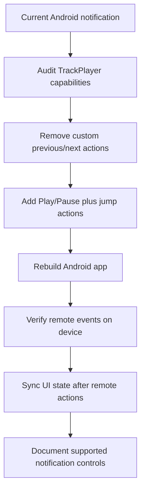

# Plan: Android Media Notification Controls

## Type
Bug Fix

## Status
Proposed

## Created Date
2026-06-23

## Last Updated
2026-06-23

## Goal Or Problem
Android system media notification controls are visible for audio playback, but the user reports that the controls do not work. The screenshot shows Android's media output card with Al-Ghurobaa metadata, progress, a center play button, jump buttons, and outer buttons that use custom speed/comment-style icons.

## Current Context
Android playback uses `react-native-track-player`; iOS still uses `expo-av`.

Relevant files:
- `apps/expo-app/index.js` registers `playbackService` before Expo Router starts.
- `apps/expo-app/src/services/audio-player/setup-track-player.ts` configures player capabilities, notification capabilities, compact notification buttons, jump intervals, and Android foreground playback behavior.
- `apps/expo-app/src/services/audio-player/playback-service.ts` handles remote play, pause, previous, next, jump backward, jump forward, seek, stop, and duck events.
- `apps/expo-app/src/store/audio-store.ts` prepares TrackPlayer, loads a single active track, requests Android 13+ notification permission, starts foreground playback, syncs progress into Zustand, and persists audio state.
- `apps/expo-app/app.config.ts` declares `FOREGROUND_SERVICE`, `FOREGROUND_SERVICE_MEDIA_PLAYBACK`, and `POST_NOTIFICATIONS`.

Observed code behavior:
- `notificationCapabilities` currently includes `SkipToPrevious`, `JumpBackward`, `Play`, `JumpForward`, and `SkipToNext`, but not `Pause`.
- `compactCapabilities` currently includes `JumpBackward`, `Play`, and `JumpForward`.
- `previousIcon` is set to the speed icon and `nextIcon` is set to the plus icon.
- `Event.RemotePrevious` cycles playback speed instead of navigating to a previous track.
- `Event.RemoteNext` opens comments instead of navigating to a next track.
- The queue usually contains one loaded track because `loadAudio` calls `TrackPlayer.reset()` and `TrackPlayer.add(track)`.

Likely causes:
- The Android notification is being asked to show media-session skip actions for app-specific actions. On a one-track queue, previous/next are semantically weak and may be disabled, ignored, or displayed in a misleading way by Android/Bluetooth/media-session clients.
- The notification exposes `Play` but not `Pause`, so the center control can become state-inconsistent or non-actionable when Android expects the matching transport action for the current player state.
- Remote actions call TrackPlayer directly from the headless service, while app UI state is updated separately through foreground listeners and polling. This can make actions appear dead or stale if the foreground JS store is not active or does not receive a follow-up state snapshot.
- If the currently installed APK/dev client was not rebuilt after adding TrackPlayer service/permission/native config changes, the JS can show the notification metadata while remote buttons still fail because native service registration or manifest state is stale. OTA updates cannot safely fix native service wiring.

## Proposed Approach
Make the Android notification boring and reliable first, then reintroduce optional app-specific actions only where the native media session supports them safely.

Use standard notification controls:
- Previous notification surface: remove speed/comment custom actions from the Android system notification.
- Target notification surface: `JumpBackward`, `Play`, `Pause`, and `JumpForward` only.
- Keep speed and comments as in-app controls, not media-session previous/next buttons.
- Only add `SkipToPrevious`/`SkipToNext` when a real queue exists and handlers perform real track navigation.

Harden remote event handling:
- Include `Capability.Pause` in notification and compact capabilities where appropriate.
- Keep `RemotePlay`, `RemotePause`, `RemoteJumpBackward`, `RemoteJumpForward`, and `RemoteSeek` as the first validated remote actions.
- Add temporary dev-only logs around remote event receipt and TrackPlayer state changes for on-device validation.
- After each remote action, fetch `TrackPlayer.getPlaybackState()` and `TrackPlayer.getProgress()` and update/signal the foreground state when the app is alive.

Validate native build state:
- Rebuild the Android dev client/APK after changing TrackPlayer configuration, app config, permissions, or native package state.
- Test on the target Android device and OS version because the system owns final notification rendering and action placement.

## Visual Plan

## Implementation Steps
- Update `setup-track-player.ts` so Android notification capabilities include `Play`, `Pause`, `JumpBackward`, and `JumpForward`, with compact controls matching standard transport behavior.
- Remove `SkipToPrevious` and `SkipToNext` from notification capabilities until the app has a real multi-track queue.
- Stop using `previousIcon` and `nextIcon` for speed/comment actions in the system notification.
- Update `playback-service.ts` so `RemotePrevious` and `RemoteNext` are either removed from the notification path or only enabled when real queue navigation exists.
- Add a shared TrackPlayer snapshot helper or event bridge so remote actions update foreground store state when the app is active.
- Add temporary development logging for remote event receipt, action success/failure, playback state, and progress.
- Rebuild and install the Android dev client/APK; do not rely on an OTA update for native media-session changes.
- Update `brain/features/audio.md` with the final supported notification behavior.

## Affected Files Or Areas
- `apps/expo-app/src/services/audio-player/setup-track-player.ts`
- `apps/expo-app/src/services/audio-player/playback-service.ts`
- `apps/expo-app/src/store/audio-store.ts`
- `apps/expo-app/app.config.ts`
- `apps/expo-app/index.js`
- `brain/features/audio.md`
- Android native build output / installed APK

## Acceptance Criteria
- Android notification play starts playback when paused.
- Android notification pause pauses playback when playing.
- Android notification jump backward moves playback backward by the configured interval.
- Android notification jump forward moves playback forward by the configured interval.
- Notification progress and play/pause state stay in sync after remote actions.
- No speed/comment buttons appear in the Android system media notification unless they are implemented as validated, supported media-session actions.
- A rebuilt Android APK/dev client behaves consistently after app backgrounding, lock screen use, and reopening the app.

## Test Plan
- Install a freshly rebuilt Android app on the target device.
- Play a known audio item and verify the notification appears with title, artist, artwork, progress, and standard controls.
- With the app foregrounded, tap play/pause/jump controls from the notification and confirm both audio output and in-app UI update.
- With the app backgrounded, repeat play/pause/jump tests.
- Lock the device and repeat play/pause/jump tests from the lock screen.
- Test Bluetooth/headset play/pause if available.
- Use logcat or dev logs to confirm each remote event is received exactly once and resolves without TrackPlayer errors.
- Kill and reopen the app to verify restored state does not create stale notification controls.

## Risks / Edge Cases
- Android OEM skins can reorder or hide compact notification actions.
- Android may continue to show only a subset of requested controls in compact mode.
- A stale installed APK can keep old native service behavior even after JS changes.
- Removing speed/comment notification actions changes a recent UX experiment; those controls should remain in the in-app player.
- The app currently loads one active track; real previous/next controls require queue design, queue state, and UI expectations.

## Open Questions
- TODO: Confirm target Android version/device where all controls fail.
- TODO: Confirm whether controls fail only from the expanded notification, the lock screen, Bluetooth/headset, or all remote surfaces.
- TODO: Decide whether speed/comment actions must ever appear in Android notification, or should remain in-app only.

## Linked Task
- Task Title: Fix Android Media Notification Controls
- Task File: brain/tasks/roadmap.md
